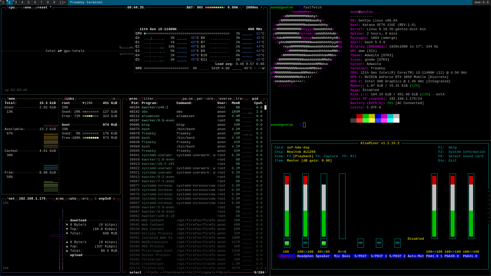

 Freakky is a simple terminal written in C++ that I created for myself.

### requirements
1.gtkmm 
 2.vte

### installation 
## 1. clone the repository
git clone https://github.com/Efesint/freakky && cd freakky
## 2. compile 
g++ freakky.cpp -o freakky $(pkg-config --cflags --libs gtkmm-3.0 vte-2.91)
## 3. add to PATH
 mkdir -p ~/bin
 cp freakky ~/bin/
 echo 'export PATH="$HOME/bin:$PATH"' >> ~/.bashrc
 source ~/.bashrc
